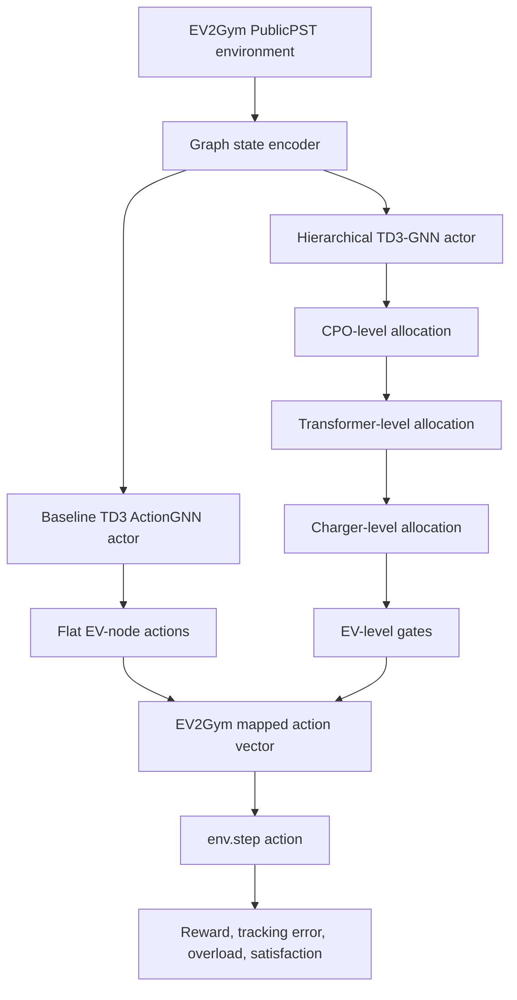

# Hierarchical EV-GNN

This repository contains a research extension of the EV-GNN baseline for large-scale electric vehicle (EV) charging coordination under EV2Gym PublicPST scenarios.

The original EV-GNN work introduces a graph-based reinforcement learning formulation for scalable EV charging coordination from a Charging Point Operator (CPO) perspective. This project keeps the simulator, graph-state representation, reward setting, and EV2Gym action interface aligned with the baseline, while replacing the flat EV-level actor with a physically aligned hierarchical actor.

## Research objective

The objective is to evaluate whether a physically aligned actor can improve control behaviour and interpretability compared with the original flat TD3 ActionGNN actor.

The proposed hierarchy follows the physical decision structure:

```text
CPO
→ Transformer
→ Charger
→ EV
```

The implementation is designed to preserve two contracts:

```text
EV2Gym contract:
  mapped_action_numpy has shape [action_dim]
  mapped_action_numpy is passed to env.step(...)

TD3 critic / replay-buffer contract:
  full_node_action has shape [num_nodes, 1]
  non-EV node rows remain zero
  EV rows contain the trainable action values
```

## Architecture overview



## Repository contents

```text
TD3/
  TD3_ActionGNN.py                    Original-style baseline ActionGNN
  TD3_ActionGNN_25cp.py               Bounded 25CP/100CP TD3 ActionGNN baseline path
  TD3_HierarchicalActionGNN.py        Main hierarchical actor implementation

utils/
  state.py                            Original-style graph state utilities
  state_25cp.py                       Bounded PublicPST graph state encoder
  replay_buffer.py                    Original-style replay buffer
  replay_buffer_25cp.py               Graph replay buffer used by bounded training path
  hierarchical_action_projection.py   Standalone projection utility / tested prototype

tests/
  test_td3_hierarchical_actiongnn_25cp_shapes.py
  test_hierarchical_projection_batched_replay.py
  test_hierarchical_action_projection_25cp.py
  test_controlled_evaluator_contract.py

analysis/
  07_100cp_formal_aggregation.py      Formal 100CP eval30 aggregation script

m3_jobs/
  01_100cp_tiny_smoke.slurm
  02_100cp_profile_cpu_10k.slurm
  03_100cp_profile_gpu_10k.slurm
  04_100cp_formal_baseline_train_50k.slurm
  05_100cp_formal_hierarchical_train_50k.slurm
  06_100cp_formal_eval30.slurm
  07_100cp_formal_aggregation.slurm

evaluator_td3_actiongnn_controlled.py Controlled baseline/hierarchical evaluator
train_RL_GNN_25cp.py                  Bounded baseline training entry point
train_RL_GNN_hierarchical_25cp.py     Hierarchical training entry point
phase2c_aggregate_analysis.py         25CP aggregation utility
```

## Main implementation change

The key contribution is `TD3/TD3_HierarchicalActionGNN.py`.

Instead of predicting EV actions with a flat final GNN layer, the hierarchical actor composes actions through a structured allocation path:

```text
graph encoding
→ transformer scores
→ charger scores
→ EV gates
→ hierarchical action projection
→ full_node_action
→ mapped_action_numpy
```

The hierarchical action value is conceptually:

```text
EV action
= total graph budget
× transformer allocation weight
× charger allocation weight
× EV gate
```

The actor still returns compatible outputs for the existing training loop:

```text
mapped_action_numpy:
  flat EV2Gym action vector for env.step(...)

full_node_action:
  graph-node action tensor for replay buffer and TD3 critic
```

## Training and evaluation entry points

### Baseline bounded training

```bash
python train_RL_GNN_25cp.py \
  --config ./config_files/PublicPST_100.yaml \
  --seed 0 \
  --device cpu \
  --run_name baseline_example \
  --max_timesteps 50000 \
  --start_timesteps 1000 \
  --eval_freq 5000 \
  --eval_episodes 5 \
  --batch_size 64 \
  --replay_buffer_size 100000 \
  --save_dir ./saved_models \
  --log_to_wandb false
```

### Hierarchical bounded training

```bash
python train_RL_GNN_hierarchical_25cp.py \
  --config ./config_files/PublicPST_100.yaml \
  --seed 0 \
  --device cpu \
  --run_name hierarchical_example \
  --max_timesteps 50000 \
  --start_timesteps 1000 \
  --eval_freq 5000 \
  --eval_episodes 5 \
  --batch_size 64 \
  --replay_buffer_size 100000 \
  --save_dir ./saved_models \
  --log_to_wandb false
```

### Controlled evaluation

```bash
python evaluator_td3_actiongnn_controlled.py \
  --algorithm baseline_25cp \
  --config ./config_files/PublicPST_100.yaml \
  --seed 0 \
  --eval_episodes 30 \
  --checkpoint ./saved_models/baseline_example/model.best \
  --device cpu \
  --output_csv ./results/baseline_100cp_seed0_eval30.csv \
  --run_name baseline_100cp_seed0_eval30 \
  --max_episode_steps 112 \
  --deterministic true \
  --eval_seed_offset 420000
```

## Validation status

### Local contract tests

The repository contains tests for:

```text
actor/action shape contracts
hierarchical projection behaviour
batched replay compatibility
controlled evaluator contract
```

Run:

```bash
pytest tests
```

### 25CP controlled evaluation

Formal 25CP evaluation used:

```text
Config: PublicPST_25cp.yaml
Algorithms: baseline_25cp and hierarchical_25cp
Seeds: 0–4
Training: 50,000 timesteps
Final evaluation: 30 controlled episodes per seed
```

Summary:

```text
mean_reward:
  baseline:      -103,412.13
  hierarchical:  -76,084.21
  paired diff:   +27,327.91
  paired t p:      0.0219

action_fraction_at_max:
  baseline:        0.5237
  hierarchical:    0.3025
  paired diff:    -0.2212
  paired t p:      0.0104
```

Interpretation:

```text
25CP provides favourable evidence that the hierarchical actor improves reward/tracking-related behaviour and reduces action saturation.
```

### 100CP controlled evaluation

Formal 100CP evaluation used:

```text
Config: PublicPST_100.yaml
Algorithms: baseline_25cp and hierarchical_25cp
Seeds: 0–4
Training: 50,000 timesteps
Final evaluation: 30 controlled episodes per seed
```

Summary:

```text
mean_reward:
  baseline:       -1,095,042.44
  hierarchical:     -847,359.43
  paired diff:      +247,683.01
  relative change:       +22.62%
  paired t p:             0.3650
  Wilcoxon p:             0.4375

action_fraction_at_max:
  baseline:            0.4763
  hierarchical:        0.3264
  paired diff:        -0.1499
  relative change:    -31.47%
  paired t p:          0.0569
```

Interpretation:

```text
At 100CP, the hierarchical actor improves reward and tracking-related metrics on average, but the paired evidence is not statistically robust across five seeds. The strongest 100CP behavioural signal is reduced action saturation, but it remains marginal rather than conventionally significant.
```

## Computational efficiency

100CP formal training resource observations:

```text
Baseline:
  runtime:        02:13:09
  CPU efficiency: 93.3%
  peak memory:    2.8GB / 32GB

Hierarchical:
  runtime:        11:08:52
  CPU efficiency: 39.1%
  peak memory:    1.7GB / 32GB
```

Interpretation:

```text
The hierarchical actor introduces substantial computational overhead. The current contribution is therefore best framed as a physically aligned control-architecture contribution, not yet as a computationally optimised replacement for the baseline.
```

## Current conclusion

The implementation is end-to-end functional and experimentally validated across 25CP and 100CP controlled-evaluation pipelines.

The current thesis-level interpretation is:

```text
The hierarchical actor shows strong positive evidence at 25CP and directional but not statistically conclusive improvement at 100CP. It also consistently reduces action saturation on average, supporting the physical-allocation design rationale. However, 100CP seed-level instability and computational overhead remain key limitations.
```

## Recommended next steps

```text
1. Prepare professor-facing code and result review.
2. Profile TD3_HierarchicalActionGNN.py for runtime bottlenecks.
3. Optimise hierarchical projection and reduce Python-side loops.
4. Do not run 500CP formal training yet.
5. If scaling is required, run 500CP smoke/profile first, not full formal.
```

## Baseline attribution

This repository builds on the EV-GNN baseline:

```text
Orfanoudakis, S., Robu, V., Salazar, E. M., Palensky, P., & Vergara, P. P. (2025).
Scalable reinforcement learning for large-scale coordination of electric vehicles using graph neural networks.
Communications Engineering, 4, Article 118.
https://doi.org/10.1038/s44172-025-00457-8
```

Original repository:

```text
https://github.com/StavrosOrf/EV-GNN
```

Original authorship and citation should be preserved in all academic use.
