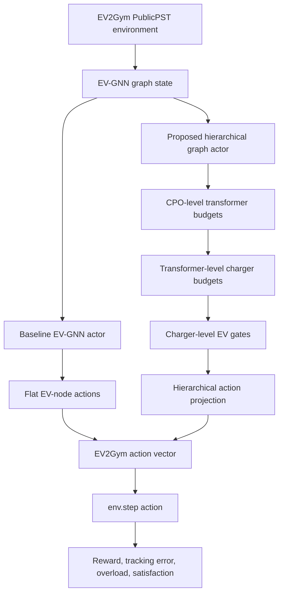

# Hierarchical EV-GNN

This repository supports a thesis research project on **physically aligned hierarchical graph reinforcement learning for large-scale electric vehicle charging coordination**.

It builds on the EV-GNN baseline by Orfanoudakis et al. (2025), where EV charging control is represented as a graph of CPO, transformer, charging-station, and EV nodes. This project investigates whether the **actor decision path** can be made more physically hierarchical by decomposing charging actions into CPO-level, transformer-level, charger-level, and EV-level allocation decisions.

## Research objective

The central objective is to test whether a physically aligned hierarchical actor can improve scalability, interpretability, and operational coherence compared with the original EV-GNN flat EV-node action architecture.



## Current repository status

| Area | Status |
| --- | --- |
| Baseline EV-GNN source code | Included |
| Baseline architecture map | `architecture_map.html` |
| 25 CP diagnostic training path | Implemented |
| 25 CP diagnostic evaluator | Implemented |
| Hierarchical action projection | Implemented and unit-tested with mock state |
| Hierarchical TD3 actor | Not implemented yet |
| Hierarchical training entry point | Placeholder only |
| SAC hierarchical extension | Out of current scope |

## Repository contents

```text
config_files/                         EV2Gym YAML configurations
TD3/                                  TD3 baseline, GNN, ActionGNN, and hierarchical placeholder
SAC/                                  SAC baseline, FX-GNN, and ActionGNN modules
utils/                                State construction, replay buffers, action wrappers, projection prototype
tests/                                Projection-layer tests
Results_Analysis/                     Baseline post-hoc analysis scripts
docs/                                 Research notes and original baseline README
architecture_map.html                 Interactive baseline paper-to-code architecture map
train_RL_GNN.py                       Original EV-GNN training entry point
train_RL_GNN_25cp.py                  25 CP diagnostic TD3_ActionGNN training entry point
train_RL_GNN_hierarchical_25cp.py     Placeholder for proposed hierarchical training entry point
evaluator_25cp.py                     25 CP diagnostic evaluator
```

## Baseline architecture

The original EV-GNN baseline contains three regimes:

```text
Classic RL:
  vector state → MLP actor/critic → flat action vector

FX-GNN:
  graph state → GNN feature extractor → pooled graph embedding → MLP action head

EV-GNN:
  graph state → end-to-end GCN actor → EV-node actions → action_mapper → flat action vector
```

The research gap is that EV-GNN represents the physical hierarchy in the graph state, but the actor still produces EV-level actions in a comparatively flat manner. This project explores whether the action-generation process itself can be made physically hierarchical.

## Proposed architecture


The proposed hierarchy is:

```text
CPO Actor
  → transformer-level budget weights

Transformer Actor
  → charger-level budget weights

Charger Actor
  → EV-level local action gates

Hierarchical Action Projection
  → EV-node action tensor
  → fixed EV2Gym action vector
```

## Validation plan

The minimum comparison should include:

```text
Classic TD3
TD3_GNN / FX-GNN
TD3_ActionGNN / EV-GNN baseline
Hierarchical TD3_ActionGNN / proposed model
```

Primary evaluation metrics:

```text
total_reward
tracking_error
energy_tracking_error
power_tracker_violation
total_transformer_overload
average_user_satisfaction
sample efficiency
training stability
```

Additional physical-alignment metrics:

```text
transformer budget utilisation
budget conservation error
charger-level allocation smoothness
allocation entropy across transformers
allocation entropy across chargers
hierarchy consistency
```

## Codex implementation scope

Before modifying implementation files, read:

```text
docs/codex_ev_gnn_research_scope_note.md
architecture_map.html
```

Implementation boundary:

```text
TD3-first.
25 CP first.
PublicPST first.
Do not rewrite the whole EV-GNN baseline.
Do not treat SAC hierarchy or full MARL as the immediate implementation target.
Do not modify baseline TD3_ActionGNN.py unless a separate experimental file is kept.
```

Next implementation target:

```text
TD3/TD3_HierarchicalActionGNN.py
train_RL_GNN_hierarchical_25cp.py
```

## Baseline reference

Orfanoudakis et al. (2025). *Scalable reinforcement learning for large-scale coordination of electric vehicles using graph neural networks*. Communications Engineering, 4:118.

DOI: https://doi.org/10.1038/s44172-025-00457-8

Original repository: https://github.com/StavrosOrf/EV-GNN

## Notes on attribution

This repository builds on the EV-GNN baseline and is currently maintained as a private thesis research repository. Original authorship and citation should be preserved in all academic use.
