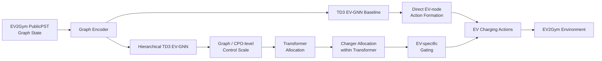

# Hierarchical EV-GNN for Large-Scale EV Charging Control

A graph reinforcement learning framework for **large-scale electric-vehicle (EV) charging coordination** under EV2Gym Public Power Setpoint Tracking (PublicPST), extending EV-GNN with explicit **CPO–Transformer–Charger–EV hierarchical decision formation**.

The project investigates a simple architectural question:

> If the charging infrastructure is already represented as a graph, can control improve when the actor also follows that physical hierarchy when forming decisions?

Both compared controllers use graph-structured state information and the same TD3 framework. The difference is **where decision structure enters the policy**: the baseline forms EV actions directly, while the proposed model allocates control through transformer and charger layers before producing EV-level actions.

---

## Architecture Overview

### Baseline: direct EV-node action formation

The controlled baseline retains the EV-GNN graph representation and TD3 learning framework, but forms charging actions directly at EV nodes.

```text
PublicPST graph state
        ↓
Graph encoder / ActionGNN
        ↓
Direct EV-node action formation
        ↓
EV charging actions
```

For the charging-only PublicPST comparison, the EV action mapping is

```text
a_i = 0.5 × a_max × (tanh(z_i) + 1)
```

so EV actions lie in `[0, a_max]`, while non-EV node rows remain zero in the graph-aligned action representation.

### Proposed model: hierarchical decision allocation

The proposed actor uses the same graph-state family but explicitly structures decision formation through the physical charging infrastructure:

```text
PublicPST graph state
        ↓
Graph / CPO-level control scale
        ↓
Transformer allocation
        ↓
Charger allocation within transformer
        ↓
EV-specific gating
        ↓
EV charging actions
```

Conceptually, an EV action is composed from a graph-level control scale, a transformer allocation weight, a charger allocation weight conditioned on its parent transformer, and an EV-specific gate.

### Side-by-side view


```mermaid
flowchart LR
    S["EV2Gym PublicPST<br/>Graph State"] --> E["Graph Encoder"]

    E --> B["TD3 EV-GNN Baseline"]
    B --> BA["Direct EV-node<br/>Action Formation"]

    E --> H["Hierarchical TD3 EV-GNN"]
    H --> G["Graph / CPO-level<br/>Control Scale"]
    G --> T["Transformer<br/>Allocation"]
    T --> C["Charger Allocation<br/>within Transformer"]
    C --> V["EV-specific<br/>Gating"]

    BA --> A["EV Charging Actions"]
    V --> A
    A --> ENV["EV2Gym Environment"]
```

The architectural contribution is therefore **not** “GNN versus hierarchy”. Both policies use topology in their state representation. The proposed model additionally uses topology to structure **decision authority and action formation**.

---

## Key Contributions

- **Infrastructure-aligned decision formation**
  Introduces explicit transformer-, charger-, and EV-level decision stages within a TD3 EV-GNN actor.

- **Controlled baseline comparison**
  Compares the hierarchy against a charging-only TD3 EV-GNN baseline under the same PublicPST task family, graph state, reward family, and continuous EV action domain.

- **Multi-scale evaluation**
  Evaluates the two architectures across 25, 100, 500, and 1000 charging-point PublicPST scenarios.

- **Mechanism-level analysis**
  Examines not only reward, but also action-boundary behaviour, graded interior control, infrastructure loading, and EV-service outcomes.

- **Reproducible experiment tooling**
  Includes training, deterministic evaluation, infrastructure diagnostics, experiment-matrix utilities, validation scripts, and automated tests.

---

## Experimental Setup

The main study compares the two architectures under a common TD3/PublicPST protocol.

| Setting | Configuration |
| --- | --- |
| Environment | EV2Gym PublicPST |
| RL algorithm | TD3 |
| Compared policies | TD3 EV-GNN Baseline vs Hierarchical TD3 EV-GNN |
| Scenarios | 25CP, 100CP, 500CP, 1000CP |
| Training seeds | 10 paired seeds per architecture and scenario |
| Training budget | 75,000 environment steps per model |
| Total trained models | 80 |
| Selected checkpoint | `model.best` |
| Final evaluation | 30 deterministic episodes per trained model |
| Infrastructure diagnostics | 30 episodes per trained model |

The four scenarios are progressively larger configured PublicPST environments. They should be interpreted as **cross-scenario robustness evidence**, rather than as a pure single-factor causal experiment in charging-point count.

---

## Results Summary

### Decision mechanism

The most consistent result is a substantial change in how the continuous action space is used.

| Scenario | Reduction in maximum-boundary action share | Increase in interior-action share |
| --- | ---: | ---: |
| 25CP | 48.8 percentage points | 46.4 percentage points |
| 100CP | 12.1 percentage points | 40.1 percentage points |
| 500CP | 32.2 percentage points | 41.8 percentage points |
| 1000CP | 27.3 percentage points | 37.2 percentage points |

Across all four scenarios, hierarchical decision formation shifts substantial control mass away from maximum-boundary charging and toward more graded interior continuous actions.

This mechanism should not be interpreted in isolation: interior actions are not inherently better unless they coexist with acceptable tracking, infrastructure, and EV-service behaviour.

### Control evidence

| Scenario | Reward evidence | Overall interpretation |
| --- | --- | --- |
| 25CP | Supported paired improvement | Clearest control benefit and strongest confirmatory evidence |
| 100CP | Strong favourable direction | Mean effect remains statistically unresolved |
| 500CP | Mixed | Strong seed dependence and heterogeneous control outcomes |
| 1000CP | Favourable mean direction | High uncertainty and substantial seed dependence |

The evidence therefore supports a **meaningful architectural improvement**, but not a universal-superiority claim. The hierarchy consistently changes the control mechanism, while reward, transformer loading, and EV-service outcomes become increasingly scenario- and seed-dependent at larger configurations.

Detailed statistical results, figures, metric definitions, and claim boundaries are available in:

- [Formal75K research notebook](docs/EV_GNN_Formal75k_Research_Analysis_v3_2_final_polished.ipynb)
- [Formal75K research report (PDF)](docs/EV_GNN_Formal75k_Research_Analysis_v3_2_final_polished.pdf)

---

## Repository Structure

```text
EV-GNN/
├── TD3/
│   ├── TD3_ActionGNN_NonNegative.py
│   ├── TD3_HierarchicalActionGNN.py
│   └── ...                         # TD3 / EV-GNN baseline implementations
│
├── config_files/
│   └── ...                         # EV2Gym PublicPST configurations
│
├── utils/
│   └── ...                         # Graph state, replay, projection and diagnostics
│
├── scripts/
│   └── ...                         # Formal experiment, validation and statistics utilities
│
├── m3_jobs/
│   └── ...                         # HPC workflow templates for large-scale experiments
│
├── tests/
│   └── ...                         # Actor, evaluator and workflow contract tests
│
├── docs/
│   ├── EV_GNN_Formal75k_Research_Analysis_v3_2_final_polished.ipynb
│   └── EV_GNN_Formal75k_Research_Analysis_v3_2_final_polished.pdf
│
├── train_td3_gnn.py                # Main TD3 EV-GNN training entry point
├── evaluate_td3_gnn.py             # Deterministic policy evaluation
├── evaluate_td3_gnn_infrastructure_diagnostics.py
├── Results_Analysis/               # Upstream EV-GNN analysis utilities
├── SAC/                            # Upstream EV-GNN SAC baseline implementation
├── evaluator.py                    # Upstream evaluator
├── train_RL_GNN.py                 # Upstream EV-GNN training entry point
├── train_baselines.py              # Upstream baseline training entry point
├── requirements.txt
└── README.md
```

The repository keeps the original EV-GNN baseline components required for provenance and compatibility, together with the hierarchical-control extension, configuration, tests, and lightweight research documentation. Large checkpoints and raw experiment outputs are intentionally excluded.

---

## Installation

The project dependencies are listed in `requirements.txt`.

```bash
python -m pip install -r requirements.txt
```

Key dependencies include EV2Gym, PyTorch, Stable-Baselines3 tooling, and Weights & Biases support.

To inspect the available command-line interfaces:

```bash
python train_td3_gnn.py --help
python evaluate_td3_gnn.py --help
python evaluate_td3_gnn_infrastructure_diagnostics.py --help
```

---

## Training

The main training entry point supports the controlled charging-only baseline and the hierarchical actor.

### Baseline

```bash
python train_td3_gnn.py \
  --algorithm actiongnn_nonnegative \
  --config config_files/PublicPST_25cp.yaml \
  --seed 0 \
  --device cpu \
  --run_name baseline_25cp_seed0 \
  --max_timesteps 75000 \
  --start_timesteps 1000 \
  --eval_freq 5000 \
  --eval_episodes 5 \
  --batch_size 64 \
  --replay_buffer_size 100000 \
  --save_dir artifacts/experiments \
  --log_to_wandb false
```

### Hierarchical model

```bash
python train_td3_gnn.py \
  --algorithm hierarchical \
  --config config_files/PublicPST_25cp.yaml \
  --seed 0 \
  --device cpu \
  --run_name hierarchical_25cp_seed0 \
  --max_timesteps 75000 \
  --start_timesteps 1000 \
  --eval_freq 5000 \
  --eval_episodes 5 \
  --batch_size 64 \
  --replay_buffer_size 100000 \
  --save_dir artifacts/experiments \
  --log_to_wandb false
```

The charging-point scale is selected through the EV2Gym configuration file. Formal experiments use scale-explicit PublicPST configurations for 25CP, 100CP, 500CP, and 1000CP.

---

## Evaluation and Diagnostics

Use the evaluator interfaces to inspect their required checkpoint and output arguments:

```bash
python evaluate_td3_gnn.py --help
python evaluate_td3_gnn_infrastructure_diagnostics.py --help
```

The repository also provides utilities for the formal experiment matrix:

```bash
python scripts/formal_75k_80cell_workflow.py --print-matrix
```

For large-scale HPC execution, see the retained workflow templates under `m3_jobs/`.

---

## Testing

Run the repository test suite with:

```bash
python -m pytest -q
```

The tests cover core actor contracts, graph-aligned action behaviour, hierarchical projection, evaluator compatibility, infrastructure diagnostics, and the formal experiment workflow.

---

## Current Research Direction

The completed multi-scale comparison establishes the full CPO–Transformer–Charger–EV hierarchy as a meaningful decision architecture, while also revealing infrastructure, service, and seed-variability trade-offs.

The next research question is **architectural attribution**:

> Does explicit charger-level allocation add control value beyond transformer-level hierarchical decision formation, or does it introduce unnecessary allocation constraints?

The planned reduced hierarchy is:

```text
Graph / CPO-level control scale
        ↓
Transformer allocation
        ↓
EV decision
        ↓
EV charging action
```

This experiment is intended to isolate which intermediate infrastructure layer contributes most to the observed control behaviour.

---

## Reference

This work builds on the EV-GNN framework introduced by:

S. Orfanoudakis, V. Robu, E. M. Salazar, P. Palensky, and P. P. Vergara,
**“Scalable reinforcement learning for large-scale coordination of electric vehicles using graph neural networks,”**
*Communications Engineering*, 4, 118, 2025.
DOI: https://doi.org/10.1038/s44172-025-00457-8

Original EV-GNN repository: https://github.com/StavrosOrf/EV-GNN

The TD3 implementation is based on:

S. Fujimoto, H. van Hoof, and D. Meger,
**“Addressing Function Approximation Error in Actor-Critic Methods,”** 2018.
arXiv: https://arxiv.org/abs/1802.09477
